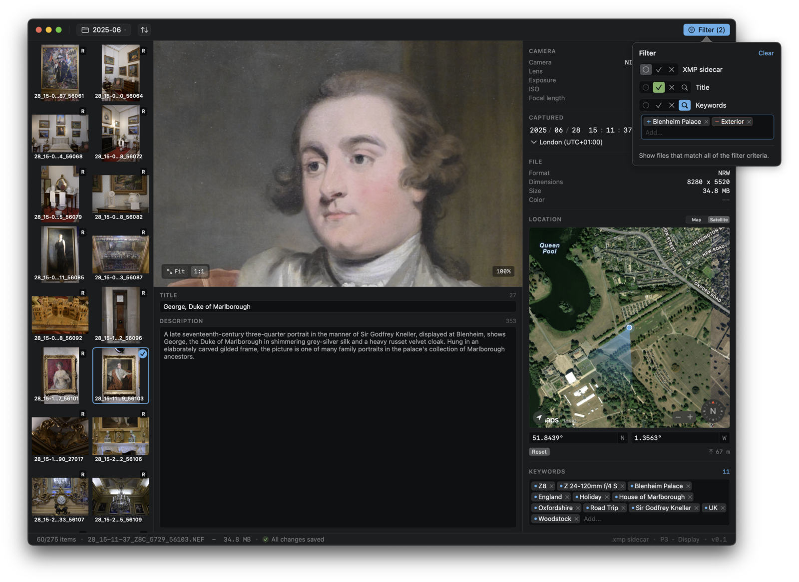
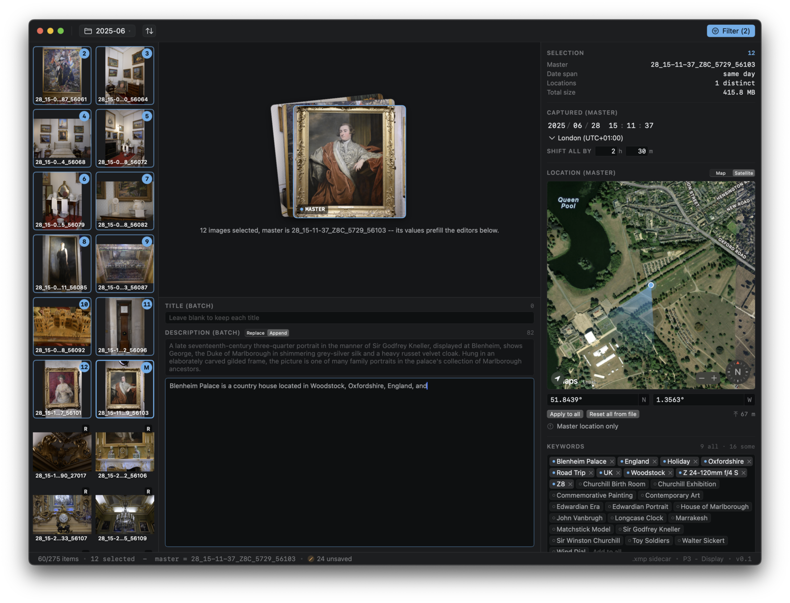

# Mantle

Mantle is a native macOS app for reviewing and editing photo metadata. Point
it at a folder of images, browse the thumbnails, and edit the descriptive
fields that matter for cataloguing and licensing: title, caption, keywords,
star rating, capture date and time zone, and GPS location. It reads and writes through
[ExifTool](https://exiftool.org), so it understands the same XMP, IPTC, and
EXIF tags that Lightroom, Photo Mechanic, and Photoshop use, and it stores
edits in XMP sidecar files so your original RAW and JPEG files are left
untouched.

Mantle is source-available under the PolyForm Noncommercial License 1.0.0:
free to use, modify, and share for any noncommercial purpose. See
[LICENSE](LICENSE).

## Screenshots

Editing a single image, with the library filter panel open:



Batch mode: editing title, caption, keywords, and location across a selection:



## Features

- Open any folder of photos and browse it as a thumbnail grid.
- Edit the descriptive fields tools actually care about: Title, caption,
  keywords, star rating, capture date and time zone, and GPS coordinates.
- Rate a photo from the editable star overlay on the preview; it round-trips
  through the standard XMP rating other tools read.
- Place or move the location pin on a map, type coordinates in decimal or
  degrees-minutes-seconds, or copy and paste them between Mantle and a map.
- Read-only view of the embedded EXIF (camera, lens, exposure) for reference.
- Batch mode: select many images and apply edits across all of them at once.
- Filter a large library by any attribute, with keyword autocomplete.
- Non-destructive: edits land in XMP sidecar files next to the originals,
  merged over the embedded metadata on read so precedence is predictable.

## Requirements

- macOS 14 (Sonoma) or later, Apple Silicon.
- Swift 6 toolchain (Xcode 16 or a matching open-source toolchain) to build.

## Building

Mantle is a Swift Package. ExifTool is not committed to the repository; it is
fetched on demand into `Sources/Mantle/Resources/exiftool/` by a helper
script. The build script below runs that fetch for you.

To build a runnable `.app` bundle (and a DMG) under `dist/`:

```sh
./scripts/build-app.sh
```

To run directly from the package during development:

```sh
./scripts/ensure-exiftool.sh   # fetch the vendored ExifTool once
swift run
```

Note: the build ad-hoc signs the app (no paid Apple Developer ID), so the
first launch is blocked by Gatekeeper. Open System Settings -> Privacy and
Security and click "Open Anyway" to allow it.

## Project layout

```
Sources/Mantle/
  App/        App entry point, commands, AppDelegate
  IO/         ExifTool and ImageIO readers/writers, sidecar and index logic
  Stores/     Observable app state, edit and save coordination
  Models/     Plain data types (ImageRecord, edits, filters, ...)
  Views/      SwiftUI views for the browser, metadata panes, and map
  Theme/      Colors and typography
  Resources/  Info.plist, icons, entitlements; vendored ExifTool at runtime
scripts/      build-app.sh, ensure-exiftool.sh
```

## Third-party software

Mantle bundles [ExifTool](https://exiftool.org) by Phil Harvey, used under the
Artistic License or the GNU General Public License. ExifTool is fetched at
build time and is not part of this repository's source tree.

## License

Copyright 2026 Tahir Hashmi.

Mantle is licensed under the
[PolyForm Noncommercial License 1.0.0](https://polyformproject.org/licenses/noncommercial/1.0.0).
You may use, modify, and distribute it for any noncommercial purpose, and the
license includes a patent grant. Commercial use is not granted by this
license. The full text is in the [LICENSE](LICENSE) file.

This is a source-available license, not an open-source / free-software
license: the noncommercial restriction means it does not meet the Open Source
Definition. ExifTool, which Mantle bundles at build time, keeps its own
separate license (see below).

For commercial licensing, contact the copyright holder.
